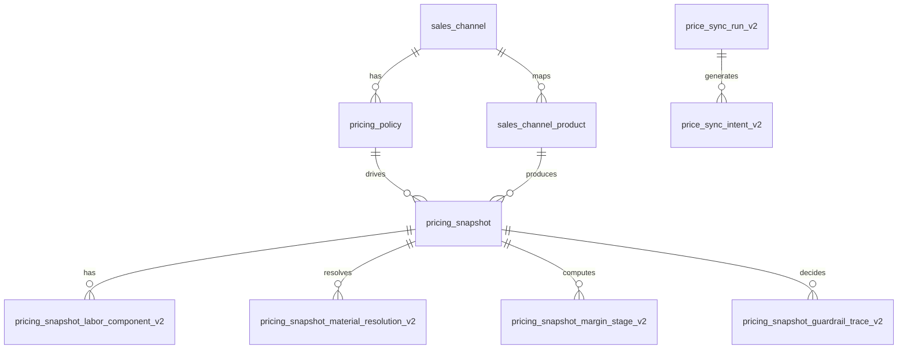

# ERD: Pricing V2 Contract (No Floor, Min-Margin Guardrail)

- Document version: v3.0
- Date: 2026-03-05
- Scope: additive schema for material-code pricing V2

---

## 1. Design Principles

1. Snapshot is the single source of truth for explain and replay.
2. Add-only schema extension; legacy V1 remains readable.
3. V2 final target has no floor dependency.
4. Every computed V2 price must be traceable to versioned inputs.

---

## 2. Conceptual ERD

---

## 3. Table Contracts

### 3.1 `pricing_policy` (extend)

Add columns:
- `gm_material numeric not null default 0`
- `gm_labor numeric not null default 0`
- `gm_fixed numeric not null default 0`
- `fee_rate numeric not null default 0`
- `min_margin_rate_total numeric not null default 0`
- `fixed_cost_krw integer not null default 0`
- `pricing_algo_default text not null default 'LEGACY_V1'`

Keep existing legacy columns:
- `margin_multiplier`
- `rounding_unit`
- `rounding_mode`

Constraints:
- `0 <= gm_material and gm_material < 1`
- `0 <= gm_labor and gm_labor < 1`
- `0 <= gm_fixed and gm_fixed < 1`
- `0 <= fee_rate and fee_rate < 1`
- `0 <= min_margin_rate_total and min_margin_rate_total < 1`
- `fee_rate + min_margin_rate_total < 1`

### 3.2 `pricing_snapshot` (extend)

Add identity/version fields:
- `pricing_algo_version text`
- `calc_version text`
- `resolution_input_hash text`

Add material resolution outputs:
- `material_code_effective text`
- `material_basis_resolved text`
- `material_purity_rate_resolved numeric`
- `material_adjust_factor_resolved numeric`
- `effective_tick_krw_g numeric`

Add V2 stage fields:
- `cost_sum_krw integer`
- `material_pre_fee_krw integer`
- `labor_pre_fee_krw integer`
- `fixed_pre_fee_krw integer`
- `candidate_pre_fee_krw integer`
- `candidate_price_krw integer`
- `min_margin_price_krw integer`
- `guardrail_price_krw integer`
- `guardrail_reason_code text`
- `final_target_price_v2_krw integer`

No-floor rule for V2:
- floor columns may remain for legacy compatibility,
- but V2 writes `final_target_price_v2_krw` without floor-stage clamp.

### 3.3 `pricing_snapshot_labor_component_v2` (new)

Primary key:
- `(snapshot_id, component_key)`

Columns:
- `snapshot_id uuid not null`
- `component_key text not null` (`BASE_LABOR`,`STONE_LABOR`,`PLATING`,`ETC`,`DECOR`)
- `labor_cost_krw integer not null`
- `labor_absorb_applied_krw integer not null`
- `labor_absorb_raw_krw integer not null default 0`
- `labor_cost_plus_absorb_krw integer not null`
- `labor_sell_krw integer not null`
- `labor_sell_plus_absorb_krw integer not null`
- `labor_class text not null` (`GENERAL`,`MATERIAL`)

Constraints:
- `labor_cost_plus_absorb_krw = labor_cost_krw + labor_absorb_applied_krw`
- `labor_sell_plus_absorb_krw = labor_sell_krw + labor_absorb_applied_krw`
- `labor_absorb_applied_krw <= labor_absorb_raw_krw`

### 3.4 `pricing_snapshot_material_resolution_v2` (new)

Primary key:
- `snapshot_id`

Columns:
- `snapshot_id uuid not null`
- `material_code_default text`
- `option_material_code text`
- `material_code_effective text not null`
- `material_ruleset_version text not null`
- `material_resolution_source_id text not null`
- `material_resolution_effective_at timestamptz not null`
- `material_resolution_status text not null` (`OK`,`FALLBACK`,`MISSING`,`CONFLICT`)

### 3.5 `pricing_snapshot_margin_stage_v2` (new)

Primary key:
- `snapshot_id`

Columns:
- `snapshot_id uuid not null`
- `gm_material numeric not null`
- `gm_labor numeric not null`
- `gm_fixed numeric not null`
- `fee_rate numeric not null`
- `min_margin_rate_total numeric not null`
- `fixed_cost_krw integer not null`
- `rounding_unit integer not null`
- `rounding_mode text not null`

### 3.6 `pricing_snapshot_guardrail_trace_v2` (new)

Primary key:
- `snapshot_id`

Columns:
- `snapshot_id uuid not null`
- `candidate_price_krw integer not null`
- `min_margin_price_krw integer not null`
- `guardrail_price_krw integer not null`
- `guardrail_reason_code text not null`
- `final_target_price_v2_krw integer not null`

---

## 4. View Contract

### 4.1 Current view

`public.v_channel_price_dashboard` remains for legacy consumers and operational parity.

### 4.2 New view

Create `public.v_price_composition_flat_v2` from snapshot tables only.

Required projection groups:
1. identity/time columns
2. material resolution columns
3. labor component columns including `*_labor_sell_plus_absorb_krw`
4. absorb raw/applied summary
5. V2 stage outputs (`candidate_price_krw`, `min_margin_price_krw`, `guardrail_price_krw`, `final_target_price_v2_krw`)
6. current channel price + diff columns

No floor projection is required for V2 decision columns.

---

## 5. Indices

- `pricing_snapshot(channel_id, compute_request_id)`
- `pricing_snapshot(pricing_algo_version, computed_at desc)`
- `pricing_snapshot_labor_component_v2(snapshot_id, component_key)`
- `pricing_snapshot_material_resolution_v2(snapshot_id)`
- `pricing_snapshot_guardrail_trace_v2(snapshot_id)`
- `pricing_snapshot_margin_stage_v2(snapshot_id)`

---

## 6. Migration Plan (Additive)

Phase 1:
- add policy columns + checks
- add snapshot V2 columns
- create new V2 component/resolution/margin/guardrail tables

Phase 2:
- dual write in recompute (V1 + V2)
- populate V2 stage trace rows

Phase 3:
- create `v_price_composition_flat_v2`
- enable explain endpoint read path by feature flag

Phase 4:
- sync run V2 intent generation by V2 target
- monitor divergence and push success

Rollback:
- disable V2 read/write flags
- keep additive schema untouched
- keep V1 behavior unchanged

---

## 7. Data Integrity Checks

1. `fee_rate + min_margin_rate_total < 1`
2. V2 rows must have non-null guardrail reason
3. `final_target_price_v2_krw >= guardrail_price_krw` only by rounding increment
4. component sums must match snapshot totals
5. replay using stored snapshot fields reproduces same V2 final price

---

## 8. Forbidden Patterns

1. Hidden floor clamp in V2 final decision.
2. Storing only final V2 price without stage columns.
3. Non-deterministic rule winner selection.
4. Float-dependent business outputs without integer KRW normalization.
5. Mixing live-table recalculation into explain/read path.
