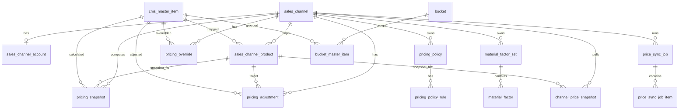

# ERD: 쇼핑몰(카페24) 가격관리/동기화 데이터 모델 (v3)

- 문서 버전: v3.0
- 작성일: 2026-02-27
- 목적: 쇼핑몰 가격 계산/비교/동기화/이력 추적을 위한 DB 모델 정의
- 설계 원칙: 기존 마스터/공임/BOM/시세 객체는 `Read` 참조, 쇼핑몰 운영 도메인은 신규 테이블로 분리

---

## 1. 모델링 원칙

1. 계산식 결과는 반드시 `snapshot`으로 남긴다.
2. 외부 채널 가격 조회값도 별도 snapshot으로 분리한다.
3. push 실행은 `job` + `job_item`으로 분리해 부분 실패를 허용한다.
4. 정책(factor/margin/rounding), 조정(adjustment), 강제값(override)을 독립 엔터티로 분리한다.
5. 향후 상세페이지 bucket 연동을 위해 테이블 자리를 선반영한다.

---

## 2. 기존 참조 객체 (신규 생성 아님)

본 ERD는 아래 기존 객체를 참조한다.

- `cms_master_item`
  - 주의: 실 PK는 `master_id`, 호환용 `master_item_id`(generated) 존재
- `cms_master_absorb_labor_item_v1`
- `cms_v_bom_recipe_worklist_v1`
- `cms_v_bom_recipe_lines_enriched_v1`
- `cms_v_market_tick_latest_by_symbol_ops_v1`

권장 FK 기준:

- 신규 테이블 FK는 `cms_master_item.master_item_id` 기준으로 통일(API/화면 표현 일치)

---

## 3. 신규 ENUM 정의

이미 유사 enum이 있더라도 쇼핑몰 도메인 독립성을 위해 신규 enum 네임스페이스를 권장한다.

```sql
-- 채널 타입
create type shop_e_channel_type as enum ('CAFE24');

-- 계정 상태
create type shop_e_account_status as enum ('CONNECTED', 'EXPIRED', 'ERROR', 'DISCONNECTED');

-- 라운딩 모드
create type shop_e_rounding_mode as enum ('CEIL', 'ROUND', 'FLOOR');

-- factor set 스코프
create type shop_e_factor_scope as enum ('GLOBAL', 'CHANNEL');

-- adjustment 적용 대상/단계/타입
create type shop_e_adjust_apply_to as enum ('LABOR', 'TOTAL');
create type shop_e_adjust_stage as enum ('PRE_MARGIN', 'POST_MARGIN');
create type shop_e_adjust_amount_type as enum ('ABSOLUTE_KRW', 'PERCENT');

-- sync job 상태
create type shop_e_sync_job_status as enum ('RUNNING', 'SUCCESS', 'PARTIAL', 'FAILED', 'CANCELLED');
create type shop_e_sync_item_status as enum ('SUCCESS', 'FAILED', 'SKIPPED');
create type shop_e_run_type as enum ('MANUAL', 'AUTO');

-- dashboard 상태
create type shop_e_price_state as enum ('OK', 'OUT_OF_SYNC', 'ERROR', 'UNMAPPED');

-- bucket(향후)
create type shop_e_bucket_type as enum ('COLLECTION', 'TAG_GROUP', 'CAMPAIGN');
```

---

## 4. 신규 테이블 상세 정의

## 4.1 `sales_channel`

채널 마스터.

| 컬럼 | 타입 | Null | 기본값 | 제약/설명 |
|---|---|---|---|---|
| channel_id | uuid | N | gen_random_uuid() | PK |
| channel_type | shop_e_channel_type | N |  | `CAFE24` |
| channel_code | text | N |  | 운영 식별 코드, unique |
| channel_name | text | N |  | 화면 표시명 |
| is_active | boolean | N | true | 비활성 시 push 금지 |
| created_at | timestamptz | N | now() |  |
| updated_at | timestamptz | N | now() |  |

인덱스/제약:

- `pk_sales_channel(channel_id)`
- `uq_sales_channel_code(channel_code)`

---

## 4.2 `sales_channel_account`

채널 인증/연동 정보.

| 컬럼 | 타입 | Null | 기본값 | 제약/설명 |
|---|---|---|---|---|
| account_id | uuid | N | gen_random_uuid() | PK |
| channel_id | uuid | N |  | FK -> sales_channel.channel_id |
| mall_id | text | N |  | Cafe24 mall id |
| shop_no | int | N | 1 | Cafe24 shop number |
| client_id_enc | text | Y |  | 암호화 저장 |
| client_secret_enc | text | Y |  | 암호화 저장 |
| access_token_enc | text | Y |  | 암호화 저장 |
| access_token_expires_at | timestamptz | Y |  |  |
| refresh_token_enc | text | Y |  | 암호화 저장 |
| refresh_token_expires_at | timestamptz | Y |  |  |
| api_version | text | Y |  | 예: 2025-12-01 |
| status | shop_e_account_status | N | 'DISCONNECTED' | 연결 상태 |
| last_error_code | text | Y |  | 최근 오류코드 |
| last_error_message | text | Y |  | 최근 오류메시지 |
| created_at | timestamptz | N | now() |  |
| updated_at | timestamptz | N | now() |  |

인덱스/제약:

- `idx_sales_channel_account_channel(channel_id)`
- `uq_sales_channel_account_channel(channel_id)` (채널당 대표 계정 1개 정책)

---

## 4.3 `sales_channel_product`

마스터-채널 상품 매핑.

| 컬럼 | 타입 | Null | 기본값 | 제약/설명 |
|---|---|---|---|---|
| channel_product_id | uuid | N | gen_random_uuid() | PK |
| channel_id | uuid | N |  | FK -> sales_channel |
| master_item_id | uuid | N |  | FK -> cms_master_item.master_item_id |
| external_product_no | text | N |  | Cafe24 product_no |
| external_variant_code | text | Y |  | 추후 옵션 대응 |
| mapping_source | text | N | 'MANUAL' | MANUAL/CSV/AUTO |
| is_active | boolean | N | true |  |
| created_at | timestamptz | N | now() |  |
| updated_at | timestamptz | N | now() |  |

인덱스/제약:

- `uq_sales_channel_product_ext(channel_id, external_product_no)`
- `idx_sales_channel_product_master(channel_id, master_item_id)`

정책 옵션:

- 기본 1:1
- 필요 시 `master_item_id` 중복 허용(1:N) 가능

---

## 4.4 `pricing_policy`

채널 기본 가격 정책.

| 컬럼 | 타입 | Null | 기본값 | 제약/설명 |
|---|---|---|---|---|
| policy_id | uuid | N | gen_random_uuid() | PK |
| channel_id | uuid | N |  | FK -> sales_channel |
| policy_name | text | N |  |  |
| margin_multiplier | numeric(12,6) | N | 1.000000 | >= 0 |
| rounding_unit | int | N | 1000 | 10/100/1000 등 |
| rounding_mode | shop_e_rounding_mode | N | 'CEIL' |  |
| material_factor_set_id | uuid | Y |  | FK -> material_factor_set.factor_set_id |
| is_active | boolean | N | true |  |
| created_at | timestamptz | N | now() |  |
| updated_at | timestamptz | N | now() |  |

인덱스/제약:

- `uq_pricing_policy_channel_active(channel_id) where is_active=true`
- `check (margin_multiplier >= 0)`
- `check (rounding_unit > 0)`

---

## 4.5 `pricing_policy_rule` (선택)

채널 정책 세부 룰(소재/카테고리별 override).

| 컬럼 | 타입 | Null | 기본값 | 제약/설명 |
|---|---|---|---|---|
| rule_id | uuid | N | gen_random_uuid() | PK |
| policy_id | uuid | N |  | FK -> pricing_policy |
| match_material_code | text | Y |  | 예: GOLD_14K |
| match_category_code | text | Y |  |  |
| margin_multiplier_override | numeric(12,6) | Y |  |  |
| rounding_unit_override | int | Y |  |  |
| rounding_mode_override | shop_e_rounding_mode | Y |  |  |
| priority | int | N | 100 | 낮을수록 우선 |
| is_active | boolean | N | true |  |
| created_at | timestamptz | N | now() |  |
| updated_at | timestamptz | N | now() |  |

---

## 4.6 `material_factor_set`

Factor Set 메타.

| 컬럼 | 타입 | Null | 기본값 | 제약/설명 |
|---|---|---|---|---|
| factor_set_id | uuid | N | gen_random_uuid() | PK |
| scope | shop_e_factor_scope | N |  | GLOBAL/CHANNEL |
| channel_id | uuid | Y |  | scope=CHANNEL일 때 필수 |
| name | text | N |  | 세트명 |
| description | text | Y |  |  |
| is_active | boolean | N | true |  |
| is_global_default | boolean | N | false | GLOBAL에서 1개만 true 권장 |
| created_at | timestamptz | N | now() |  |
| updated_at | timestamptz | N | now() |  |

제약:

- `check ((scope='GLOBAL' and channel_id is null) or (scope='CHANNEL' and channel_id is not null))`
- partial unique: `uq_material_factor_set_global_default` (`is_global_default=true` and `scope='GLOBAL'`)

---

## 4.7 `material_factor`

Factor Set별 소재 multiplier.

| 컬럼 | 타입 | Null | 기본값 | 제약/설명 |
|---|---|---|---|---|
| factor_id | uuid | N | gen_random_uuid() | PK |
| factor_set_id | uuid | N |  | FK -> material_factor_set |
| material_code | text | N |  | 예: GOLD_14K, SILVER_925 |
| multiplier | numeric(12,6) | N | 1.000000 |  |
| note | text | Y |  |  |
| created_at | timestamptz | N | now() |  |
| updated_at | timestamptz | N | now() |  |

인덱스/제약:

- `uq_material_factor_set_code(factor_set_id, material_code)`
- `check (multiplier > 0)`

---

## 4.8 `pricing_adjustment`

상품별 가격 가감(+/-) 규칙.

| 컬럼 | 타입 | Null | 기본값 | 제약/설명 |
|---|---|---|---|---|
| adjustment_id | uuid | N | gen_random_uuid() | PK |
| channel_id | uuid | N |  | FK -> sales_channel |
| channel_product_id | uuid | Y |  | FK -> sales_channel_product |
| master_item_id | uuid | Y |  | FK -> cms_master_item.master_item_id |
| apply_to | shop_e_adjust_apply_to | N |  | LABOR/TOTAL |
| stage | shop_e_adjust_stage | N |  | PRE/POST_MARGIN |
| amount_type | shop_e_adjust_amount_type | N | 'ABSOLUTE_KRW' | v1은 KRW 중심 |
| amount_value | numeric(18,4) | N | 0 | 음수 허용 |
| priority | int | N | 100 |  |
| reason | text | Y |  |  |
| valid_from | timestamptz | Y |  |  |
| valid_to | timestamptz | Y |  |  |
| is_active | boolean | N | true |  |
| created_by | uuid | Y |  | 운영자 id |
| created_at | timestamptz | N | now() |  |
| updated_at | timestamptz | N | now() |  |

핵심 제약:

- `check (channel_product_id is not null or master_item_id is not null)`
- `check (valid_to is null or valid_from is null or valid_to >= valid_from)`

권장 추가 트리거:

- `channel_product_id`가 있을 때 해당 row의 `channel_id`와 일치 여부 검증

---

## 4.9 `pricing_override`

강제 최종가.

| 컬럼 | 타입 | Null | 기본값 | 제약/설명 |
|---|---|---|---|---|
| override_id | uuid | N | gen_random_uuid() | PK |
| channel_id | uuid | N |  | FK -> sales_channel |
| master_item_id | uuid | N |  | FK -> cms_master_item.master_item_id |
| override_price_krw | numeric(18,0) | N |  | 0 이상 |
| reason | text | Y |  |  |
| valid_from | timestamptz | Y |  |  |
| valid_to | timestamptz | Y |  |  |
| is_active | boolean | N | true |  |
| created_by | uuid | Y |  |  |
| created_at | timestamptz | N | now() |  |
| updated_at | timestamptz | N | now() |  |

인덱스/제약:

- `idx_pricing_override_active(channel_id, master_item_id, is_active)`
- `check (override_price_krw >= 0)`

---

## 4.10 `pricing_snapshot`

권장가 계산 스냅샷(핵심).

| 컬럼 | 타입 | Null | 설명 |
|---|---|---|---|
| snapshot_id | uuid | N | PK |
| channel_id | uuid | N | FK -> sales_channel |
| master_item_id | uuid | N | FK -> cms_master_item.master_item_id |
| channel_product_id | uuid | Y | FK -> sales_channel_product |
| computed_at | timestamptz | N | 계산 시각 |
| tick_as_of | timestamptz | Y | 시세 기준 시각 |
| tick_source | text | Y | INTERNAL/EXTERNAL 등 |
| tick_gold_krw_g | numeric(18,4) | Y | 금 시세 |
| tick_silver_krw_g | numeric(18,4) | Y | 은 시세 |
| net_weight_g | numeric(18,4) | Y | 순중량 |
| material_raw_krw | numeric(18,4) | N | factor 적용 전 |
| factor_set_id_used | uuid | Y | 사용 factor set |
| material_factor_multiplier_used | numeric(12,6) | N | 적용 multiplier |
| material_final_krw | numeric(18,4) | N | factor 적용 후 |
| labor_raw_krw | numeric(18,4) | N | 공임 raw |
| labor_pre_margin_adj_krw | numeric(18,4) | N |  |
| labor_post_margin_adj_krw | numeric(18,4) | N |  |
| total_pre_margin_adj_krw | numeric(18,4) | N | TOTAL PRE |
| total_post_margin_adj_krw | numeric(18,4) | N | TOTAL POST |
| base_total_pre_margin_krw | numeric(18,4) | N | 마진 전 총액 |
| margin_multiplier_used | numeric(12,6) | N | 적용 마진 |
| total_after_margin_krw | numeric(18,4) | N | 마진 후 |
| target_price_raw_krw | numeric(18,4) | N | 라운딩 전 |
| rounding_unit_used | int | N |  |
| rounding_mode_used | shop_e_rounding_mode | N |  |
| rounded_target_price_krw | numeric(18,0) | N | 라운딩 결과 |
| override_price_krw | numeric(18,0) | Y | 적용된 override 값 |
| final_target_price_krw | numeric(18,0) | N | 최종 목표가 |
| applied_adjustment_ids | jsonb | N | 적용 adjustment 목록 |
| breakdown_json | jsonb | N | 상세 근거 |
| compute_request_id | uuid | Y | recompute 요청 추적 |

인덱스:

- `idx_pricing_snapshot_latest(channel_id, master_item_id, computed_at desc)`
- `idx_pricing_snapshot_channel_product(channel_id, channel_product_id, computed_at desc)`
- `idx_pricing_snapshot_computed_at(computed_at desc)`

---

## 4.11 `channel_price_snapshot`

채널 현재가 pull 결과.

| 컬럼 | 타입 | Null | 기본값 | 설명 |
|---|---|---|---|---|
| channel_price_snapshot_id | uuid | N | gen_random_uuid() | PK |
| channel_id | uuid | N |  | FK -> sales_channel |
| channel_product_id | uuid | Y |  | FK -> sales_channel_product |
| master_item_id | uuid | Y |  | FK -> cms_master_item.master_item_id |
| external_product_no | text | N |  | Cafe24 product_no |
| current_price_krw | numeric(18,0) | Y |  | |
| currency | text | N | 'KRW' | |
| fetched_at | timestamptz | N | now() | |
| http_status | int | Y |  | |
| fetch_status | text | N | 'SUCCESS' | SUCCESS/FAILED |
| error_code | text | Y |  | |
| error_message | text | Y |  | |
| raw_json | jsonb | Y |  | 원본 일부 |

인덱스:

- `idx_channel_price_snapshot_latest(channel_id, external_product_no, fetched_at desc)`
- `idx_channel_price_snapshot_master(channel_id, master_item_id, fetched_at desc)`

---

## 4.12 `price_sync_job`

push 실행 헤더.

| 컬럼 | 타입 | Null | 기본값 | 설명 |
|---|---|---|---|---|
| job_id | uuid | N | gen_random_uuid() | PK |
| channel_id | uuid | N |  | FK -> sales_channel |
| run_type | shop_e_run_type | N | 'MANUAL' | |
| status | shop_e_sync_job_status | N | 'RUNNING' | |
| requested_by | uuid | Y |  | |
| request_payload | jsonb | Y |  | |
| success_count | int | N | 0 | |
| failed_count | int | N | 0 | |
| skipped_count | int | N | 0 | |
| started_at | timestamptz | N | now() | |
| finished_at | timestamptz | Y |  | |
| created_at | timestamptz | N | now() | |

인덱스:

- `idx_price_sync_job_channel_started(channel_id, started_at desc)`
- `idx_price_sync_job_status(status, started_at desc)`

---

## 4.13 `price_sync_job_item`

push 실행 아이템 결과.

| 컬럼 | 타입 | Null | 기본값 | 설명 |
|---|---|---|---|---|
| job_item_id | uuid | N | gen_random_uuid() | PK |
| job_id | uuid | N |  | FK -> price_sync_job |
| channel_id | uuid | N |  | FK -> sales_channel |
| channel_product_id | uuid | Y |  | FK -> sales_channel_product |
| master_item_id | uuid | Y |  | FK -> cms_master_item.master_item_id |
| external_product_no | text | N |  | |
| before_price_krw | numeric(18,0) | Y |  | push 전 |
| target_price_krw | numeric(18,0) | N |  | 요청값 |
| after_price_krw | numeric(18,0) | Y |  | 반영 후 |
| status | shop_e_sync_item_status | N | 'SUCCESS' | |
| http_status | int | Y |  | |
| error_code | text | Y |  | |
| error_message | text | Y |  | |
| raw_response_json | jsonb | Y |  | |
| updated_at | timestamptz | N | now() | |

인덱스:

- `idx_price_sync_job_item_job(job_id)`
- `idx_price_sync_job_item_master(channel_id, master_item_id, updated_at desc)`
- `idx_price_sync_job_item_status(status, updated_at desc)`

---

## 4.14 `bucket` (향후)

상세페이지 그룹 단위.

| 컬럼 | 타입 | Null | 기본값 | 설명 |
|---|---|---|---|---|
| bucket_id | uuid | N | gen_random_uuid() | PK |
| bucket_type | shop_e_bucket_type | N |  | |
| name | text | N |  | |
| slug | text | Y |  | unique |
| description | text | Y |  | |
| is_active | boolean | N | true | |
| created_at | timestamptz | N | now() | |
| updated_at | timestamptz | N | now() | |

---

## 4.15 `bucket_master_item` (향후)

| 컬럼 | 타입 | Null | 기본값 | 설명 |
|---|---|---|---|---|
| bucket_id | uuid | N |  | FK -> bucket |
| master_item_id | uuid | N |  | FK -> cms_master_item.master_item_id |
| sort_order | int | Y |  | |
| created_at | timestamptz | N | now() | |

PK/Unique:

- `pk_bucket_master_item(bucket_id, master_item_id)`

---

## 5. 대시보드 통합 뷰

권장 뷰명: `v_channel_price_dashboard`

목적:

- 운영 화면에서 필요한 최신 상태를 단일 조회로 제공
- 채널별 뷰를 복제하지 않고 `channel_id` 필터로 통합 관리

핵심 구성:

1. 매핑 기준 집합: `sales_channel_product`
2. 최신 계산값: `pricing_snapshot` 최신 row
3. 최신 현재가: `channel_price_snapshot` 최신 row
4. 활성 override/adjustment 요약
5. 차액 계산:
   - `diff_krw = final_target_price_krw - current_price_krw`
   - `diff_pct = diff_krw / nullif(current_price_krw, 0)`
6. 상태 계산:
   - `OK`: diff 허용범위 이내
   - `OUT_OF_SYNC`: diff 초과
   - `ERROR`: pull/push 최근 실패
   - `UNMAPPED`: 매핑 누락

권장 인덱스 보조 뷰:

- `pricing_snapshot_latest` materialized view 또는 distinct-on 서브뷰
- `channel_price_snapshot_latest` 서브뷰

---

## 6. 관계도 (Mermaid)



---

## 7. 정합성 규칙 (필수)

1. `sales_channel_product.external_product_no`는 채널 내 유일해야 한다.
2. `pricing_snapshot`은 계산 시점의 모든 결정값을 컬럼+json으로 함께 저장해야 한다.
3. `price_sync_job_item.target_price_krw`는 push 시점 요청값을 반드시 보존한다.
4. `pricing_adjustment`는 유효기간/활성 상태를 통과한 항목만 계산에 포함한다.
5. `pricing_override`가 활성/유효하면 `final_target_price_krw` 우선한다.
6. dashboard는 최신 snapshot 기준으로 계산하며 과거값과 혼합하지 않는다.

---

## 8. 운영/성능 인덱스 전략

- 최신값 조회 패턴 최적화:
  - `(channel_id, master_item_id, computed_at desc)`
  - `(channel_id, external_product_no, fetched_at desc)`
- 대시보드 필터 최적화:
  - 소재코드, diff, 상태 컬럼(뷰/머티리얼라이즈드뷰에서 인덱싱)
- job 모니터링:
  - `price_sync_job(status, started_at desc)`

---

## 9. 마이그레이션 적용 순서 권장

1. enum 생성
2. 채널/계정/매핑 테이블
3. 정책/factor/adjustment/override 테이블
4. snapshot/pull/push job 테이블
5. bucket(향후) 테이블
6. 대시보드 view + latest helper view
7. 제약/트리거/인덱스 보강

---

## 10. 최종 결론

- 본 ERD는 대화 요구사항(채널별 factor, 전체 factor, 상품별 +/- 조정, 공임/총액 분기, 마진 전/후 분기, bucket 고려)을 모두 구조적으로 수용한다.
- `통합 뷰 + 스냅샷` 설계를 통해 운영 가시성과 추적성을 동시에 확보한다.
- 기존 `cms_*` 가격 SoT와 충돌하지 않고, 쇼핑몰 연동 도메인을 독립 확장할 수 있다.
