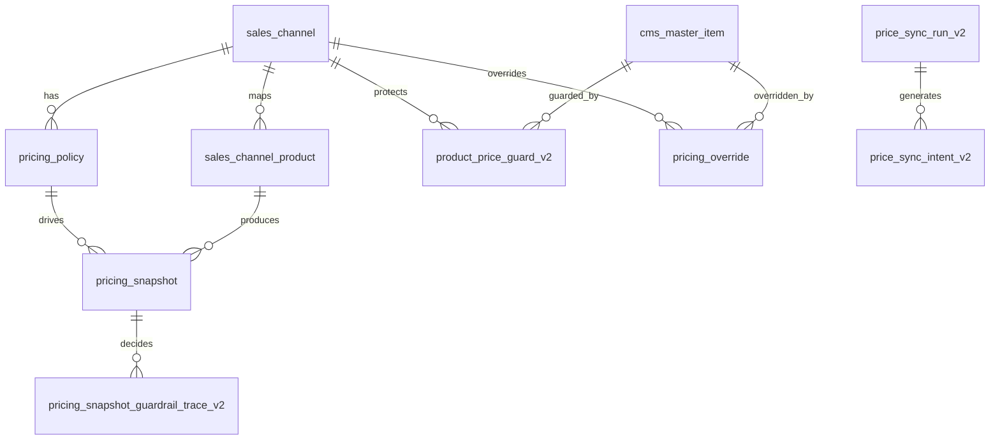

# ERD Delta: Market-Linked Threshold and Manual Exception Floor

- Document version: v1.0
- Date: 2026-03-07
- Scope: delta only for the next pricing/sync phase
- Base docs: `docs/2026-03-05_pricing-composition-stack_erd.md`, `docs/2026-03-05_pricing-composition-stack_prd.md`

---

## Purpose

This delta does not replace the existing Pricing V2 ERD. It clarifies how the next phase layers threshold profiles and manual exception controls around the existing V2 target.

Key point:
- V2 recompute target remains no-floor.
- Floor/override behavior belongs to the sync decision layer.

## Conceptual Delta

## Entity Roles

### `pricing_snapshot`
- stores recomputed market-cost-based target outputs
- remains the source of `final_target_price_v2_krw`
- no automatic floor-clamped V2 target is added in this phase

### `pricing_policy`
- owns threshold profile selection inputs
- may need additive metadata for `GENERAL` vs `MARKET_LINKED`
- does not change V2 recompute formula

### `product_price_guard_v2`
- stores manual exception floor protection
- `floor_price_krw` means final channel selling price KRW only
- never means pre-fee, pre-margin, or raw-cost basis

### `pricing_override`
- stores manual explicit final price overrides
- override is the highest-precedence commercial decision

### `price_sync_run_v2` / `price_sync_intent_v2`
- record the effective desired price after precedence is applied
- must preserve enough reason context to explain floor/override effects

## Decision-Layer Precedence

The effective desired selling price used by sync intent generation is resolved in this order:

1. recomputed `final_target_price_v2_krw`
2. explicit market-force uplift if applicable
3. active manual override
4. manual exception floor clamp, if higher than the current desired price

Interpretation:
- override can intentionally replace target
- floor can only protect against going below a chosen final selling price
- neither changes the recompute formula itself

## Threshold-Profile Contract

Threshold profile belongs to sync policy, not recompute math.

- `GENERAL`: `max(5000, current_price * 0.02)`
- `MARKET_LINKED`: `max(500, current_price * 0.005)`

These profiles affect sync intent creation speed, not `candidate_price_krw`, `min_margin_price_krw`, `guardrail_price_krw`, or `final_target_price_v2_krw`.

## Acceptance Questions

1. Is floor part of recompute or sync? -> sync only
2. What unit is `floor_price_krw`? -> final channel selling price KRW
3. Does override beat floor? -> yes
4. Does threshold profile change target calculation? -> no
5. Does market-linked policy imply immediate downsync? -> no
