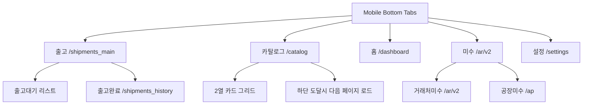

# 모바일 5탭 네비게이션 전환 PRD (출고 | 카탈로그 | 홈 | 미수 | 설정)

작성일: 2026-02-22  
작성자: OpenCode

## 1. 요청 의도와 핵심 결론

요청사항은 "현재 실제로 눌러서 쓰는 화면 기준"으로 모바일 네비게이터를 별도 구성하는 것입니다.

핵심 결론:

- 가능하다. 현재 구조는 `AppShell + SidebarNav(모바일 드로어)` 중심이며, 이를 모바일 하단 5탭으로 재구성할 수 있다.
- 탭 구성은 `출고 | 카탈로그 | 홈 | 미수 | 설정`으로 고정하고, 각 탭 내부는 스택/세그먼트로 분기하는 것이 가장 안전하다.
- 기존 실사용 자산은 이미 충분하다. 신규 대형 화면을 만들기보다 라우트 매핑과 모바일 전용 네비게이션 계층을 먼저 정리하는 접근이 리스크가 낮다.

## 2. 프로젝트 루트 파악 결과 (근거 파일)

### 2.1 현재 네비게이션의 실제 소스 오브 트루스

- 앱 쉘 진입점: `web/src/app/(app)/layout.tsx`
- 실제 내비게이션 쉘: `web/src/components/layout/app-shell.tsx`
- 현재 메뉴 정의(가장 중요): `web/src/components/layout/nav-items.ts`
- 모바일 메뉴 드로어 렌더링: `web/src/components/layout/sidebar-nav.tsx`
- 상단바/모바일 메뉴 트리거: `web/src/components/layout/global-top-bar.tsx`

즉, **현재 모바일은 하단 탭이 아니라 드로어 기반**이다.

### 2.2 현재 클릭 가능한 실사용 라우트(메뉴 기준)

`web/src/components/layout/nav-items.ts` 기준:

- 카탈로그: `/catalog`
- 출고: `/shipments_main`
- 출고확인: `/shipments_history`
- 손님미수: `/ar/v2`
- 공장미수: `/ap`
- 설정: `/settings`
- 홈 후보: `/dashboard` (현재 `/`가 `dashboard`로 redirect)

참고: `sidebar.tsx`, `top-nav.tsx`는 현재 AppShell에 연결되지 않은 레거시 성격이다.

### 2.3 탭별 재사용 가능한 기존 화면

- 출고: `web/src/app/(app)/shipments_main/page.tsx`, `web/src/app/(app)/shipments_history/page.tsx`
- 카탈로그: `web/src/app/(app)/catalog/page.tsx`, `web/src/components/catalog/CatalogGalleryGrid.tsx`
- 홈: `web/src/app/(app)/dashboard/page.tsx`
- 미수: `web/src/app/(app)/ar/v2/page.tsx`, `web/src/app/(app)/ap/page.tsx`
- 설정: `web/src/app/(app)/settings/page.tsx`

## 3. 목표와 비목표

### 3.1 목표

- 모바일에서 1차 도달 동선을 5탭으로 단순화한다.
- 현재 실사용 중인 업무 화면(출고/카탈로그/홈/미수/설정)을 하단탭으로 빠르게 접근 가능하게 만든다.
- 탭 진입 후 상세 흐름은 기존 페이지 자산을 최대한 재사용한다.

### 3.2 비목표

- 출고/미수/카탈로그 비즈니스 로직 재작성
- 기존 데스크톱 사이드바 IA의 전면 교체
- 대규모 데이터 모델 변경

## 4. 정보구조(IA) 제안

### 4.1 모바일 하단 탭 IA

1) 출고  
2) 카탈로그  
3) 홈  
4) 미수  
5) 설정

### 4.2 탭-라우트 매핑

- 출고 탭 기본 진입: `/shipments_main`
  - 세그먼트 A: 출고대기(기존 `shipments_main`의 필터 기본값 활용)
  - 세그먼트 B: 출고완료(`/shipments_history`를 탭 내부 링크로 연결)
- 카탈로그 탭 기본 진입: `/catalog`
  - 기본 레이아웃: 2열 카드 그리드
  - 추가 로딩: 무한 스크롤
- 홈 탭 기본 진입: `/dashboard`
  - 시세, KPI, 작업대 요약 카드 집약
- 미수 탭 기본 진입: `/ar/v2`
  - 세그먼트 A: 거래처미수(`/ar/v2`)
  - 세그먼트 B: 공장미수(`/ap`)
- 설정 탭 기본 진입: `/settings`
  - 사용자 정보/환경설정 우선 노출

### 4.3 활성 탭 판정 규칙 (중요)

현재 `web/src/components/layout/nav-items.ts`의 `isNavItemActive`는 `shipments` prefix 중심이라,
`/shipments_main`과 `/shipments_history`를 하나의 "출고" 탭으로 묶을 때 오판정 가능성이 있다.

모바일 5탭에서는 아래처럼 탭 그룹 기준으로 active를 판정한다.

- 출고 탭 active routes:
  - `/shipments_main`
  - `/shipments`
  - `/shipments_history`
  - `/shipments_print`
  - `/shipments_analysis`
- 미수 탭 active routes:
  - `/ar/v2`
  - `/ar`
  - `/ap`
  - `/ap/reconcile`
- 카탈로그 탭 active routes:
  - `/catalog`
- 홈 탭 active routes:
  - `/dashboard` (및 `/` redirect 진입)
- 설정 탭 active routes:
  - `/settings`

## 5. 시각화

### 5.1 내비게이션 구조



### 5.2 모바일 화면 와이어(텍스트)

```text
┌──────────────────────────────┐
│ [헤더] 출고                  │
│ [세그먼트] 출고대기 | 출고완료 │
│                              │
│  카드/리스트 영역            │
│  ...                         │
│                              │
├──────────────────────────────┤
│ 출고 | 카탈로그 | 홈 | 미수 | 설정 │
└──────────────────────────────┘
```

## 6. 기능 요구사항

### 6.1 출고 탭

- 기본 진입 시 출고대기 목록을 즉시 표시
- 상단 세그먼트로 출고완료 목록 전환
- 출고 생성/확정으로 이어지는 기존 링크를 유지

### 6.2 카탈로그 탭

- 카드 그리드는 모바일에서 항상 2열
- 스크롤 하단 도달 시 다음 데이터 자동 로드
- 카드 탭 시 기존 상세/편집 흐름 연결

### 6.3 홈 탭

- 시세 + 핵심 KPI + 빠른 진입 카드 노출
- 과도한 표/상세 대신 요약 중심 구성

### 6.4 미수 탭

- 거래처미수/공장미수를 탭 내부 세그먼트로 분리
- 각 세그먼트는 기존 페이지를 그대로 사용

### 6.5 설정 탭

- 사용자 정보/프로필 블록 상단 배치
- 기존 운영 설정 기능(시세/마진/팩스)은 하위 섹션으로 유지

## 7. 구현 전략 (현재 코드베이스 기준)

### 7.1 단계 1: 모바일 네비게이션 계층 도입

- 기존 `SidebarNav` 모바일 드로어를 대체 또는 병행하는 `MobileBottomNav` 컴포넌트 추가
- 표시 조건: 모바일 브레이크포인트에서만 하단 탭 노출
- 데스크톱은 기존 사이드바 유지

### 7.2 단계 2: 탭 라우트 연결

- 하단 탭 아이템을 위 5개 라우트로 연결
- 활성 상태 판별은 `nav-items.ts`의 active 판별 규칙을 재사용/확장

### 7.3 단계 3: 탭 내부 세그먼트 연결

- 출고: `/shipments_main` 내부에서 `shipments_history`로 이동 토글
- 미수: `/ar/v2`와 `/ap` 간 상단 세그먼트 제공

### 7.4 단계 4: 카탈로그 무한스크롤

- 현재 `catalog`의 페이지네이션 상태(`page`, `activePageSize`)를 인터섹션 기반 추가 로드로 전환
- 2열 카드 레이아웃은 `CatalogGalleryGrid`를 모바일 기준으로 고정

## 8. 성능/운영 고려사항

- 하단 탭은 5개 고정(변동/숨김 최소화)
- 탭 화면 초기 렌더 부담이 크므로 lazy mount 또는 쿼리 staleTime 튜닝 필요
- 카탈로그 무한스크롤은 요청 중복 방지 락과 마지막 페이지 처리 필요
- `shipments_main`은 `refetchOnMount:"always"` + visibility refetch가 있어 모바일 탭 전환 시 과호출 리스크가 있다 (`web/src/app/(app)/shipments_main/page.tsx`)
- `/ar/v2`, `/ap`, `/settings`는 `h-[calc(100vh-4rem)]` 레이아웃이라 하단 탭바 도입 시 안전영역/높이 재계산이 필요하다

## 9. 리스크와 대응

- 리스크: 기존 드로어 사용자 습관과 충돌
  - 대응: 초기 릴리즈에서 드로어를 fallback으로 유지 가능
- 리스크: 카탈로그 페이지가 대형 컴포넌트라 무한스크롤 전환 시 회귀 가능
  - 대응: 1) 기존 페이지네이션 보존 2) 옵트인 플래그로 점진 적용
- 리스크: 미수 탭에서 AR/AP 의미 혼동
  - 대응: 세그먼트 라벨을 "거래처미수 / 공장미수"로 고정 표기

## 10. 수용 기준 (Acceptance Criteria)

1. 모바일에서 하단 탭 5개가 항상 노출된다.  
2. 각 탭이 지정 라우트로 즉시 이동한다.  
3. 출고 탭에서 출고대기/출고완료 전환이 가능하다.  
4. 카탈로그 탭이 2열 카드 + 하단 추가 로드를 지원한다.  
5. 미수 탭에서 거래처미수/공장미수 전환이 가능하다.  
6. 설정 탭에서 사용자 정보 블록이 최상단에 표시된다.
7. 출고 탭 active가 `/shipments_main`, `/shipments`, `/shipments_history`, `/shipments_print`, `/shipments_analysis`에서 일관되게 유지된다.
8. 미수 탭 active가 `/ar/v2`, `/ar`, `/ap`, `/ap/reconcile`에서 일관되게 유지된다.
9. 하단 탭바 추가 후 `/ar/v2`, `/ap`, `/settings` 화면에서 하단 컨텐츠/CTA 가림이 없다.

## 11. 권장 구현 순서

1) 모바일 하단 탭 컴포넌트 도입  
2) 5탭 라우트 연결  
3) 출고/미수 세그먼트 연결  
4) 카탈로그 무한스크롤 전환  
5) QA(모바일/데스크톱 동작, 라우트 회귀) 완료

---

본 문서는 현재 코드베이스의 실제 라우트/컴포넌트를 근거로 작성되었으며, "현재 눌러서 쓰는 기능" 중심으로 모바일 IA를 재정렬한 실행용 PRD이다.
