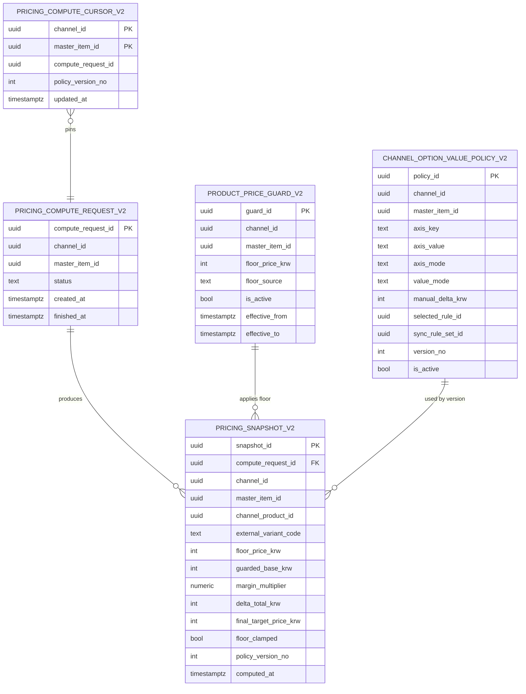
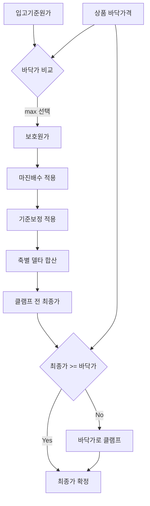
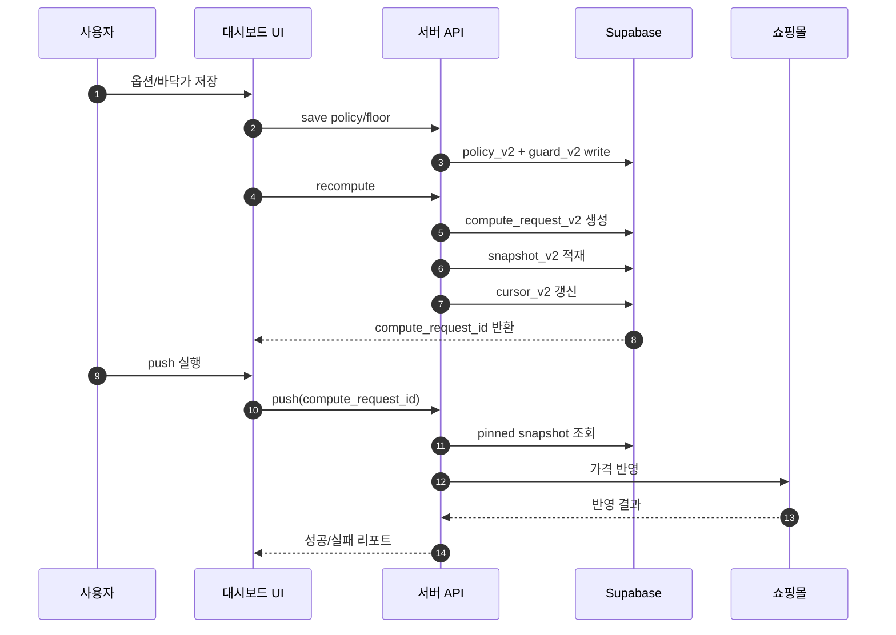
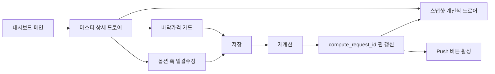

# 옵션 가격 SoT 재구축 v2 PRD + ERD + UI 계획서 (한글)

## 1) 문서 목적

- 기존 옵션 정책/스냅샷 꼬임을 **폐기 전제**로 정리하고, 새 구조(v2)로 전환한다.
- 저장값, 대시보드 표시값, push 반영값이 항상 동일한 계산 버전(`compute_request_id`)을 바라보도록 만든다.
- 모든 상품에 **바닥가격**을 강제해, 시세/룰 변화가 있어도 최종가가 바닥가격 아래로 내려가지 않게 한다.

---

## 2) 제품 요구사항(PRD)

### 2.1 목표

- 결정론적 가격: 같은 입력이면 항상 같은 결과.
- 단일 SoT: 계산/표시/push 기준 버전이 하나.
- 바닥가 보장: `final_target_price_krw >= floor_price_krw` 항상 성립.
- 룰 잔재 제거: `Sync(룰없음)`일 때 룰합은 무조건 0.

### 2.2 범위

- 포함
  - 옵션 정책 저장(v2)
  - 재계산 스냅샷(v2)
  - 커서(현재 핀 버전) 관리(v2)
  - 바닥가격 테이블 도입(v2)
  - 대시보드/드로어/UI를 v2 기준으로 전환
- 제외
  - 기존(v1) 정책/스냅샷 데이터 이관
  - 자동 push (저장 즉시 push는 하지 않음)

### 2.3 핵심 운영 룰

- 룰 A: 저장 -> 재계산(`compute_request_id` 생성) -> 화면 갱신
- 룰 B: push는 명시적 버튼만, 그리고 `compute_request_id` 필수
- 룰 C: 룰 미선택 시 룰기여금 0, 추론 계산 금지
- 룰 D: 동일 `external_variant_code` 활성 행은 1개만 허용
- 룰 E: 바닥가 미설정 상품은 재계산 실패 처리

### 2.4 가격 공식 (확정)

1. 보호원가: `guarded_base_krw = max(base_inbound_cost_krw, floor_price_krw)`
2. 마진적용가: `price_after_margin_krw = round(guarded_base_krw * margin_multiplier)`
3. 축합계: `delta_total_krw = delta_material + delta_size + delta_color + delta_decor + delta_other`
4. 클램프 전: `final_target_before_floor_krw = price_after_margin_krw + base_adjust_krw + delta_total_krw`
5. 최종가: `final_target_price_krw = max(final_target_before_floor_krw, floor_price_krw)`

예시:
- 입고기준가 1,200,000 / 바닥가 1,300,000 / 마진배수 1.50 / 기준보정 -20,000
- 축별 델타: 소재 +4,000, 사이즈 0, 색상 +2,000, 장식 0, 기타 +1,000
- 계산:
  - 보호원가 = 1,300,000
  - 마진적용가 = 1,950,000
  - 축합계 = 7,000
  - 클램프 전 = 1,937,000
  - 최종가 = max(1,937,000, 1,300,000) = 1,937,000

---

## 3) 데이터 모델(ERD) + 컬럼 사전

### 3.1 테이블 요약

- `product_price_guard_v2`: 상품별 바닥가격 SoT
- `channel_option_value_policy_v2`: 축/값 정책 SoT
- `pricing_compute_request_v2`: 재계산 실행 헤더
- `pricing_snapshot_v2`: 행 단위 최종 계산 결과 SoT
- `pricing_compute_cursor_v2`: 현재 대시보드/push가 바라볼 핀 버전

### 3.2 컬럼 사전

#### A. product_price_guard_v2 (바닥가격)

| 컬럼 | 타입 | 설명 | 제약 |
|---|---|---|---|
| guard_id | uuid | 바닥가격 행 ID | PK |
| channel_id | uuid | 채널 식별자 | NOT NULL |
| master_item_id | uuid | 마스터 상품 식별자 | NOT NULL |
| floor_price_krw | integer | 최저 허용 가격 | NOT NULL, >= 0 |
| floor_source | text | 입력 출처(MANUAL/FORMULA/SYSTEM) | NOT NULL |
| is_active | boolean | 현재 유효 여부 | NOT NULL |
| effective_from | timestamptz | 적용 시작 시각 | NOT NULL |
| effective_to | timestamptz | 적용 종료 시각 | NULL 가능 |
| created_at/updated_at | timestamptz | 생성/수정 시각 | NOT NULL |
| created_by/updated_by | text | 작업자 식별 | NULL 가능 |

핵심 제약:
- 활성 바닥가격 유일: `(channel_id, master_item_id)` where `is_active=true` 유일

#### B. channel_option_value_policy_v2 (옵션 정책)

| 컬럼 | 타입 | 설명 | 제약 |
|---|---|---|---|
| policy_id | uuid | 정책 행 ID | PK |
| channel_id | uuid | 채널 | NOT NULL |
| master_item_id | uuid | 마스터 상품 | NOT NULL |
| axis_key | text | 축 이름(소재/사이즈/색상/장식/기타) | NOT NULL |
| axis_value | text | 축 값(14K/W/18호 등) | NOT NULL |
| axis_mode | text | 축 모드(SYNC/OVERRIDE) | NOT NULL |
| value_mode | text | 값 모드(SYNC/DIRECT) | NOT NULL |
| manual_delta_krw | integer | 수동 추가금 | NOT NULL, default 0 |
| selected_rule_id | uuid | 선택 룰 ID | NULL 가능 |
| sync_rule_set_id | uuid | 룰셋 ID | NULL 가능 |
| version_no | integer | 정책 버전 | NOT NULL |
| is_active | boolean | 활성 여부 | NOT NULL |
| change_reason | text | 변경 사유 | NULL 가능 |
| created_at/created_by | timestamptz/text | 생성 시각/작업자 | NOT NULL/NULL |

핵심 제약:
- 버전 유일: `(channel_id, master_item_id, axis_key, axis_value, version_no)` 유일

#### C. pricing_compute_request_v2 (재계산 실행)

| 컬럼 | 타입 | 설명 | 제약 |
|---|---|---|---|
| compute_request_id | uuid | 계산 버전 ID | PK |
| channel_id | uuid | 채널 | NOT NULL |
| master_item_id | uuid | 마스터 상품 | NOT NULL |
| status | text | RUNNING/DONE/FAILED | NOT NULL |
| requested_by | text | 요청자 | NULL 가능 |
| request_reason | text | 실행 사유 | NULL 가능 |
| error_message | text | 실패 메시지 | NULL 가능 |
| created_at | timestamptz | 시작 시각 | NOT NULL |
| finished_at | timestamptz | 종료 시각 | NULL 가능 |

#### D. pricing_snapshot_v2 (계산 결과)

| 컬럼 | 타입 | 설명 | 제약 |
|---|---|---|---|
| snapshot_id | uuid | 스냅샷 행 ID | PK |
| compute_request_id | uuid | 계산 버전 ID | FK, NOT NULL |
| channel_id/master_item_id/channel_product_id | uuid | 대상 식별 | NOT NULL |
| external_variant_code | text | 외부 옵션 코드 | NULL 가능 |
| base_inbound_cost_krw | integer | 입고 기준 원가 | NOT NULL |
| floor_price_krw | integer | 적용된 바닥가 | NOT NULL |
| guarded_base_krw | integer | max(입고원가, 바닥가) | NOT NULL |
| margin_multiplier | numeric(10,4) | 마진 배수 | NOT NULL |
| price_after_margin_krw | integer | 마진 적용 결과 | NOT NULL |
| base_adjust_krw | integer | 기준보정 합 | NOT NULL |
| delta_material_krw | integer | 소재 델타 | NOT NULL |
| delta_size_krw | integer | 사이즈 델타 | NOT NULL |
| delta_color_krw | integer | 색상/도금 델타 | NOT NULL |
| delta_decor_krw | integer | 장식 델타 | NOT NULL |
| delta_other_krw | integer | 기타 델타 | NOT NULL |
| delta_total_krw | integer | 축합계 | NOT NULL |
| final_target_before_floor_krw | integer | 바닥가 적용 전 최종값 | NOT NULL |
| final_target_price_krw | integer | 최종 목표가(바닥가 보장) | NOT NULL |
| floor_clamped | boolean | 바닥가로 올림 발생 여부 | NOT NULL |
| policy_version_no | integer | 사용 정책 버전 | NOT NULL |
| computed_at | timestamptz | 계산 시각 | NOT NULL |

핵심 제약:
- `(compute_request_id, channel_product_id)` 유일
- `delta_total_krw = material+size+color+decor+other`
- `final_target_price_krw >= floor_price_krw`

#### E. pricing_compute_cursor_v2 (핀 버전 포인터)

| 컬럼 | 타입 | 설명 | 제약 |
|---|---|---|---|
| channel_id | uuid | 채널 | PK(복합) |
| master_item_id | uuid | 마스터 상품 | PK(복합) |
| compute_request_id | uuid | 현재 화면/푸시 기준 계산 버전 | NOT NULL |
| policy_version_no | integer | 현재 정책 버전 | NOT NULL |
| updated_at | timestamptz | 포인터 갱신 시각 | NOT NULL |

---

## 4) 시각화

### 4.1 ER 다이어그램

### 4.2 가격 계산 플로우

### 4.3 저장-재계산-푸시 시퀀스

### 4.4 UI 와이어플로우

---

## 5) UI 계획 (요구 반영)

### 5.1 화면 구성

- 화면 1: 마스터 상세 드로어(기존 `dashboard/page.tsx` 내)
  - 블록 A: 바닥가격 관리 카드(입력/히스토리/활성 상태)
  - 블록 B: 옵션 축 일괄수정(소재/사이즈/색상/장식/기타)
  - 블록 C: 계산식 보기 버튼(스냅샷 드로어 오픈)
  - 블록 D: 현재 핀 버전 표시(`compute_request_id`)
- 화면 2: 스냅샷 계산식 드로어(기존 `PricingSnapshotDrawer` 확장)
  - Section A: 원가/바닥/보호원가/마진
  - Section B: 축별 델타
  - Section C: 바닥가 클램프 전/후 최종가
  - Section D: 메타데이터(버전/시각/정책버전)

### 5.2 UI 상태 규칙

- 재계산 전: push 버튼 비활성, "먼저 재계산 필요" 안내
- 재계산 성공 후: `pinnedComputeRequestId` 갱신, push 활성
- 바닥가격 미설정: 저장/재계산 버튼 비활성 + 오류 메시지
- `Sync(룰없음)` 표기 시 룰합Δ 강제 0 표시

### 5.3 UI 컴포넌트 계획

- 재사용
  - `web/src/components/ui/sheet.tsx`
  - `web/src/components/shop/PricingSnapshotDrawer.tsx`
- 신규(예정)
  - `FloorPriceCard` (바닥가격 입력/검증/상태)
  - `PinnedComputeBadge` (`compute_request_id`/정책버전 표시)
  - `VariantUniquenessAlert` (중복 variant 경고)

### 5.4 API 계약 (UI 연동)

- `POST /api/pricing/recompute` -> `{ compute_request_id }` 필수 반환
- `GET /api/channel-price-snapshot-explain` -> `channel_id, master_item_id, compute_request_id` 필수
- `POST /api/channel-prices/push` -> `compute_request_id` 필수(없으면 4xx)
- `POST /api/channel-floor-guards` (신규) -> 바닥가격 upsert

---

## 6) 마이그레이션/컷오버 계획 (폐기 전제)

### 6.1 단계

1. 백업 스냅샷 추출(v1)
2. v2 테이블/제약 생성
3. `sales_channel_product` 활성 variant 유일 제약 적용
4. API/UI를 v2 read/write로 전환
5. v1 읽기 차단, v2 단독 운영

### 6.2 절대 조건

- v1 데이터는 이관하지 않음(폐기)
- 컷오버 후 생성되는 데이터만 정식 운영 데이터로 인정

---

## 7) 검증 체크리스트

- [ ] 모든 행에서 `delta_total_krw == 축별합`
- [ ] 모든 행에서 `final_target_price_krw >= floor_price_krw`
- [ ] `Sync(룰없음)` 케이스 룰합Δ 0
- [ ] 중복 active variant 0건
- [ ] push 결과와 대시보드 최종가 불일치 0건

---

## 8) 리스크와 대응

- 리스크: 동시 저장으로 커서 엇갈림
  - 대응: 커서 갱신을 재계산 트랜잭션 경계 내에서 처리
- 리스크: 오래된 클라이언트가 구버전 API 호출
  - 대응: v2 강제 4xx + 안내 메시지
- 리스크: 중복 variant 재발
  - 대응: DB unique partial index로 구조적 차단

---

## 9) 결정사항(합의용)

- 폐기 방식: v1 정책/스냅샷 미이관
- 강제 정책: 바닥가격 없는 상품은 재계산 불가
- push 정책: 핀된 `compute_request_id` 없는 push 금지
